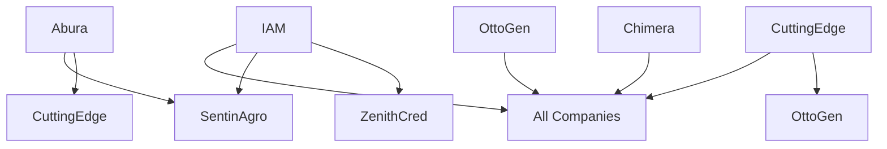

# Oopuo Multi-Company Operating System Research

**Research Report: AI-Powered Holding Company Architecture**  
*Date: January 28, 2025*

## Executive Summary

This report outlines a comprehensive framework for structuring Oopuo as an AI-powered holding company that efficiently manages seven subsidiary companies through an integrated operating system. The proposed architecture balances operational efficiency with necessary information isolation, creating a scalable platform for multi-company management.

**Key Companies in Scope:**
- **ZenithCred**: Financial/Credit services
- **SentinAgro**: Agricultural monitoring and services  
- **OttoGen**: AI generation and automation
- **IAM**: Identity and Access Management
- **CuttingEdge**: Technology solutions
- **Abura**: Energy/Resource management
- **Chimera**: Multi-domain integration platform

---

## 1. Company Tunneling Architecture

### 1.1 Work Routing Matrix

The Oopuo OS implements a hub-and-spoke model with selective direct connections:

```
Central Hub (Otto/Kira)
├── ZenithCred (Financial Gateway)
│   ├── Direct: IAM (authentication)
│   └── Isolated: All others
├── SentinAgro (Agricultural Operations)
│   ├── Direct: Abura (energy needs), Chimera (data integration)
│   └── Limited: ZenithCred (billing only)
├── OttoGen (AI/Automation Core)
│   ├── Direct: All companies (AI services)
│   └── Controlled: Data access per company policy
├── IAM (Security/Access)
│   ├── Direct: All companies (authentication)
│   └── Audit: Full visibility for compliance
├── CuttingEdge (Technology)
│   ├── Direct: OttoGen, Chimera (tech stack)
│   └── Support: All others (IT services)
├── Abura (Energy/Resources)
│   ├── Direct: SentinAgro, CuttingEdge (power/infrastructure)
│   └── Limited: Others (basic utilities)
└── Chimera (Integration Platform)
    ├── Direct: All companies (data orchestration)
    └── Filtered: Data access based on permissions
```

### 1.2 Shared vs Isolated Resources

**Shared Resources:**
- **Otto/Kira AI Core**: Central intelligence available to all
- **IAM Infrastructure**: Single sign-on, authentication, authorization
- **CuttingEdge IT Stack**: Shared technology platform
- **Chimera Data Bus**: Approved data exchanges
- **Abura Power Grid**: Physical infrastructure

**Isolated Resources:**
- **Customer Data**: Each company maintains separate customer databases
- **Financial Records**: ZenithCred has isolated financial processing
- **Proprietary Algorithms**: Company-specific IP protected
- **Regulatory Compliance**: Industry-specific requirements isolated
- **Competitive Intelligence**: Market research kept separate

### 1.3 Information Barriers

**Regulatory Barriers:**
- **Financial (ZenithCred)**: SOX compliance, PCI-DSS isolation
- **Agricultural (SentinAgro)**: USDA data protection, farmer privacy
- **Energy (Abura)**: FERC compliance, grid security protocols

**Competitive Barriers:**
- **Customer Lists**: No cross-company customer sharing without consent
- **Pricing Models**: Isolated pricing strategies per company
- **Strategic Plans**: Company roadmaps kept confidential

**Implementation:**
```python
class InformationBarrier:
    def __init__(self, source_company, target_company, data_type):
        self.barrier_rules = {
            "ZenithCred": {
                "financial_data": ["BLOCK_ALL"],
                "customer_pii": ["BLOCK_ALL"], 
                "credit_scores": ["BLOCK_ALL"]
            },
            "SentinAgro": {
                "farmer_data": ["BLOCK_EXCEPT", "Abura.energy_optimization"],
                "crop_yields": ["ALLOW", "OttoGen.analytics"]
            }
        }
```

---

## 2. Team Communication Framework

### 2.1 AI-Human Communication Protocols

**Three-Tier Communication Model:**

1. **Direct Interface (CEO Level)**
   - Otto provides executive summaries to CEO
   - One-click decision points presented
   - Strategic recommendations with confidence scores

2. **Management Interface (Company Presidents)**
   - Kira provides company-specific AI assistance
   - Department-level status reports
   - Resource request management

3. **Operational Interface (Team Level)**
   - Company-specific AI agents for daily tasks
   - Workflow automation and assistance
   - Task delegation and progress tracking

### 2.2 Async vs Sync Handoffs

**Asynchronous (Default Mode):**
- **Status Updates**: Daily automated reports via Slack/Teams
- **Task Completion**: AI notifies humans when work is done
- **Approval Workflows**: AI queues decisions for human review
- **Data Analysis**: AI processes overnight, delivers insights by morning

**Synchronous (High-Priority):**
- **Emergency Alerts**: Real-time notifications for critical issues
- **Financial Approvals**: Immediate escalation for large expenditures
- **Customer Escalations**: Direct handoff when AI reaches limits
- **Strategic Decisions**: Live collaboration on major business choices

### 2.3 Status Reporting Per Company

**Daily Health Check (Automated):**
```
ZenithCred Status Report - Jan 28, 2025
├── Credit Decisions Processed: 1,247 (+12% vs yesterday)
├── AI Confidence Score: 94% (within normal range)
├── Regulatory Compliance: ✓ All systems green
├── Revenue Today: $87,543 (+8% vs last week)
└── Issues Requiring Attention: 2 (see details below)
```

**Weekly Executive Summary:**
- KPI trends and anomalies
- Resource utilization across companies
- Cross-company synergy opportunities
- Risk assessments and mitigation status

---

## 3. Input/Output Management

### 3.1 What Each Company Needs from Central (Otto/Kira)

**ZenithCred:**
- **Inputs**: Market data feeds, regulatory updates, customer verification
- **AI Services**: Risk assessment models, fraud detection, compliance monitoring
- **Infrastructure**: Secure payment processing, audit logging

**SentinAgro:**
- **Inputs**: Weather data, commodity prices, agricultural research
- **AI Services**: Crop optimization models, yield predictions, pest detection
- **Infrastructure**: IoT sensor management, satellite imagery processing

**OttoGen:**
- **Inputs**: Computing resources, training data access, model parameters
- **AI Services**: Meta-learning, model optimization, performance monitoring
- **Infrastructure**: GPU clusters, distributed training systems

**IAM:**
- **Inputs**: Security threat intelligence, compliance requirements
- **AI Services**: Anomaly detection, access pattern analysis
- **Infrastructure**: Directory services, certificate management

**CuttingEdge:**
- **Inputs**: Technology trends, vendor information, technical specifications
- **AI Services**: Technology stack optimization, performance monitoring
- **Infrastructure**: Development environments, deployment pipelines

**Abura:**
- **Inputs**: Energy market data, consumption patterns, grid status
- **AI Services**: Load optimization, predictive maintenance
- **Infrastructure**: Smart grid management, energy storage systems

**Chimera:**
- **Inputs**: Data from all companies, integration requirements
- **AI Services**: Data harmonization, ETL optimization
- **Infrastructure**: Data lakes, processing pipelines

### 3.2 What Each Company Delivers

**To Central (Otto/Kira):**
- **Performance Metrics**: Revenue, costs, efficiency indicators
- **Market Intelligence**: Industry insights, customer feedback
- **Operational Data**: Process improvements, best practices
- **Risk Signals**: Early warning indicators, compliance status

**Cross-Company Value:**
- **ZenithCred → Others**: Payment processing, financial verification
- **SentinAgro → Abura**: Energy consumption patterns, optimization opportunities
- **OttoGen → All**: AI model improvements, automation capabilities
- **IAM → All**: Security insights, access optimization
- **CuttingEdge → All**: Technical infrastructure, development tools
- **Abura → SentinAgro/CuttingEdge**: Reliable power, energy management
- **Chimera → All**: Data integration, cross-company analytics

### 3.3 Dependencies Between Companies

**Critical Dependencies:**


**Dependency Management Strategy:**
- **Service Level Agreements**: 99.9% uptime for critical services
- **Graceful Degradation**: Fallback modes when dependencies fail
- **Redundancy**: Backup systems for essential services
- **Priority Queuing**: Critical company needs get priority access

---

## 4. Sandboxing Strategy

### 4.1 Memory Isolation Per Company

**Multi-Tenant AI Architecture:**

Each company operates in isolated memory spaces with controlled sharing:

```python
class CompanySandbox:
    def __init__(self, company_id):
        self.company_id = company_id
        self.memory_namespace = f"company_{company_id}"
        self.shared_memory_access = self._configure_shared_access()
        
    def _configure_shared_access(self):
        # Granular control over shared resources
        return {
            "otto_core": "read_only",
            "iam_services": "authenticated_access",
            "common_apis": "rate_limited"
        }
```

**Memory Isolation Levels:**
1. **Complete Isolation**: Customer data, financial records, proprietary algorithms
2. **Controlled Sharing**: Aggregated analytics, industry benchmarks
3. **Open Sharing**: Public data, common utilities, shared infrastructure

### 4.2 Credential Separation

**Multi-Layer Security Model:**

```yaml
Credential_Architecture:
  Level_1_Company_Root:
    - Company-specific master keys
    - Isolated certificate authorities
    - Separate HSM partitions
    
  Level_2_Service_Specific:
    - API keys per service
    - Database credentials
    - Third-party integrations
    
  Level_3_User_Access:
    - Individual user credentials
    - Role-based permissions
    - Time-limited tokens

Cross_Company_Access:
  - Zero-trust architecture
  - Explicit approval required
  - Audit trail mandatory
  - Time-limited access tokens
```

### 4.3 Audit Trails

**Comprehensive Logging Strategy:**

**What Gets Logged:**
- All data access requests (successful and failed)
- Cross-company data sharing events
- Administrative actions and policy changes
- AI decision points and reasoning
- Security events and anomalies

**Log Structure:**
```json
{
  "timestamp": "2025-01-28T14:30:00Z",
  "event_type": "data_access",
  "source_company": "SentinAgro",
  "target_company": "Abura", 
  "data_type": "energy_consumption",
  "user_id": "agent_kira_sentinagro",
  "approval_chain": ["ceo", "sentinagro_president"],
  "data_sensitivity": "internal",
  "retention_period": "7_years"
}
```

**Audit Capabilities:**
- Real-time monitoring dashboard
- Automated compliance reporting
- Forensic investigation tools
- Pattern analysis for unusual activity

---

## 5. UI/UX for CEO Dashboard

### 5.1 What Otto Needs to See Daily

**Primary Dashboard Components:**

**1. Company Health Overview (Top Row)**
```
┌─ ZenithCred ─┐ ┌─ SentinAgro ─┐ ┌─ OttoGen ─┐ ┌─ IAM ─┐
│ Rev: ↑12%    │ │ Rev: ↑8%     │ │ Rev: ↑15% │ │ 99.9% │
│ Ops: Green   │ │ Ops: Yellow  │ │ Ops: Green│ │ Uptime│
│ Risk: Low    │ │ Risk: Medium │ │ Risk: Low │ │ 0 Alerts│
└─────────────┘ └─────────────┘ └───────────┘ └───────┘

┌─ CuttingEdge ┐ ┌─ Abura ──────┐ ┌─ Chimera ──┐ ┌─ Summary ─┐
│ Rev: ↑6%     │ │ Rev: ↑20%    │ │ Rev: ↑10%  │ │ Total Rev │
│ Ops: Green   │ │ Ops: Green   │ │ Ops: Green │ │ ↑11.4%   │
│ Risk: Low    │ │ Risk: Low    │ │ Risk: Low  │ │ 🎯 Target │
└─────────────┘ └─────────────┘ └───────────┘ └───────────┘
```

**2. Strategic Metrics (Middle Section)**
- **Cross-Company Synergies**: Active collaborations, shared resources
- **Market Position**: Competitive analysis, market share trends  
- **Innovation Pipeline**: R&D investments, patent applications
- **Financial Health**: Cash flow, profitability, growth rate

**3. AI Agent Status (Bottom Section)**
- **Otto Performance**: Decision accuracy, processing speed
- **Kira Deployment**: Agent utilization across companies
- **Automation ROI**: Time saved, cost reductions
- **AI Risk Assessment**: Model drift, bias detection

### 5.2 Alert Priorities

**Priority 1 (Immediate CEO Attention)**
- Revenue drops >10% in any company
- Security breaches or compliance violations
- Major customer complaints escalated to CEO level
- System outages affecting multiple companies
- Regulatory investigation notices

**Priority 2 (Same Day Review)**
- Unusual cross-company data access patterns
- Significant market shifts affecting strategy
- New competitive threats identified
- AI model performance degradation
- Employee satisfaction score drops

**Priority 3 (Weekly Review)**
- Industry trend analysis updates
- Resource reallocation recommendations
- Long-term strategic planning insights
- Technology upgrade proposals
- Partnership opportunity assessments

### 5.3 One-Click Actions

**Financial Actions:**
- **Budget Approvals**: Pre-approved spending up to $100K per company
- **Investment Decisions**: Portfolio rebalancing recommendations
- **Cash Management**: Inter-company loan approvals

**Operational Actions:**
- **Resource Reallocation**: Move computing/personnel between companies
- **Emergency Response**: Activate crisis management protocols
- **Strategic Pivots**: Approve market expansion or contraction

**AI Management:**
- **Model Deployment**: Approve new AI capabilities across companies
- **Data Sharing**: Authorize cross-company data initiatives
- **Automation Expansion**: Scale successful AI implementations

**Implementation Example:**
```javascript
// One-click approval system
const ceoActions = {
  approveBudget: (company, amount) => {
    if (amount <= 100000) {
      return autoApprove(company, amount);
    } else {
      return requestDetailedReview(company, amount);
    }
  },
  
  reallocateResources: (fromCompany, toCompany, resourceType) => {
    return triggerResourceTransfer(fromCompany, toCompany, resourceType);
  }
};
```

---

## 6. Scaling Inner Systems

### 6.1 Sub-Agents Per Company

**Hierarchical Agent Architecture:**

```
Otto (CEO Level)
├── Kira (COO Level)
│   ├── ZenithAgent (ZenithCred Operations)
│   │   ├── RiskAgent (Credit Risk Assessment)
│   │   ├── ComplianceAgent (Regulatory Monitoring)
│   │   └── CustomerAgent (Service Automation)
│   ├── AgriAgent (SentinAgro Operations)
│   │   ├── CropAgent (Yield Optimization)
│   │   ├── WeatherAgent (Climate Monitoring)
│   │   └── MarketAgent (Commodity Trading)
│   ├── GenAgent (OttoGen Operations)
│   │   ├── ModelAgent (AI Development)
│   │   ├── TrainingAgent (Model Training)
│   │   └── DeployAgent (Production Deployment)
│   └── [Similar hierarchies for IAM, CuttingEdge, Abura, Chimera]
```

**Agent Specialization Strategy:**
- **Domain Expertise**: Each agent specialized in company's core business
- **Learning Transfer**: Successful patterns shared across similar agents
- **Autonomy Levels**: Graduated independence based on proven performance
- **Human Oversight**: Escalation paths for complex decisions

### 6.2 Memory Architecture Per Company

**Distributed Memory System:**

```python
class CompanyMemory:
    def __init__(self, company_name):
        self.short_term = ShortTermMemory(size="1GB", ttl="24h")
        self.working = WorkingMemory(size="10GB", ttl="30d")
        self.long_term = LongTermMemory(size="100GB", persistent=True)
        self.shared_context = SharedMemory(access_level="controlled")
        
    def memory_hierarchy(self):
        return {
            "immediate": self.short_term,    # Current session data
            "recent": self.working,          # Project context
            "historical": self.long_term,    # Company knowledge base
            "collaborative": self.shared_context  # Cross-company insights
        }
```

**Memory Optimization Strategies:**
- **Intelligent Caching**: Frequently accessed data kept in fast memory
- **Contextual Compression**: Summarize old conversations, keep key facts
- **Knowledge Graphs**: Relationship mapping for efficient information retrieval
- **Federated Learning**: Share insights without sharing raw data

### 6.3 Resource Allocation

**Dynamic Resource Management:**

**CPU/GPU Allocation:**
```yaml
Resource_Pool:
  Total_Capacity: 1000 cores, 500 GPUs
  Base_Allocation:
    ZenithCred: 150 cores, 50 GPUs    # Real-time risk analysis
    SentinAgro: 120 cores, 100 GPUs   # Image processing, ML models
    OttoGen: 200 cores, 150 GPUs      # AI development, training
    IAM: 80 cores, 20 GPUs            # Security processing
    CuttingEdge: 150 cores, 80 GPUs   # Development environments
    Abura: 100 cores, 50 GPUs         # Grid optimization
    Chimera: 100 cores, 50 GPUs       # Data processing
    Reserve: 100 cores, 0 GPUs        # Emergency allocation

Scaling_Rules:
  - Monitor utilization every 5 minutes
  - Auto-scale up to 150% of base allocation
  - Borrow from reserve pool during peak demands
  - Alert CEO if total utilization >90% for >30 minutes
```

**Cost Management:**
- **Usage-Based Billing**: Internal chargeback to companies
- **Efficiency Metrics**: ROI tracking for each AI investment
- **Capacity Planning**: Predictive scaling based on business growth
- **Cost Optimization**: Automatic shutdown of idle resources

**Scaling Triggers:**
1. **Business Growth**: Revenue growth triggers proportional resource increase
2. **Seasonal Demands**: Agricultural seasons, financial quarters
3. **Innovation Cycles**: R&D phases require additional computing power
4. **Market Opportunities**: Rapid scaling for competitive advantages

---

## Implementation Roadmap

### Phase 1 (Months 1-3): Foundation
- Deploy core Otto/Kira AI infrastructure
- Implement IAM system across all companies
- Establish basic sandboxing and audit trails
- Launch CEO dashboard MVP

### Phase 2 (Months 4-6): Integration
- Connect all companies to central OS
- Implement cross-company data sharing protocols
- Deploy company-specific AI agents
- Optimize resource allocation systems

### Phase 3 (Months 7-12): Optimization
- Advanced analytics and predictive insights
- Full automation of routine decisions
- Sophisticated cross-company synergy identification
- Scale to handle 10x current data volume

### Success Metrics
- **Operational Efficiency**: 30% reduction in manual processes
- **Decision Speed**: 50% faster strategic decisions
- **Cost Savings**: 20% reduction in operational overhead
- **Revenue Synergies**: 15% increase from cross-company collaboration

---

## Risk Assessment and Mitigation

**Technical Risks:**
- **Single Point of Failure**: Mitigated by distributed architecture
- **Data Breaches**: Prevented by zero-trust security model
- **AI Bias**: Addressed by diverse training data and regular audits

**Business Risks:**
- **Over-Automation**: Balanced by human oversight requirements
- **Competitive Information Leaks**: Prevented by information barriers
- **Regulatory Compliance**: Ensured by automated compliance monitoring

**Operational Risks:**
- **Change Management**: Phased rollout with extensive training
- **Cultural Resistance**: Addressed by demonstrating clear value
- **Vendor Lock-in**: Prevented by open architecture standards

---

## Conclusion

The proposed Oopuo Multi-Company Operating System represents a sophisticated approach to holding company management, leveraging AI to create operational synergies while maintaining necessary business boundaries. The architecture balances efficiency with security, automation with human oversight, and integration with autonomy.

Key success factors include:
1. **Gradual Implementation**: Phased approach reduces risk
2. **Strong Governance**: Clear policies and audit trails
3. **Human-AI Collaboration**: AI augments rather than replaces human judgment
4. **Continuous Optimization**: System learns and improves over time

This framework positions Oopuo to efficiently scale its multi-company operations while maintaining the flexibility to adapt to changing market conditions and regulatory requirements.

---

*End of Report*

**Research compiled by:** Subagent Research Team  
**Date:** January 28, 2025  
**Next Review:** Quarterly updates recommended